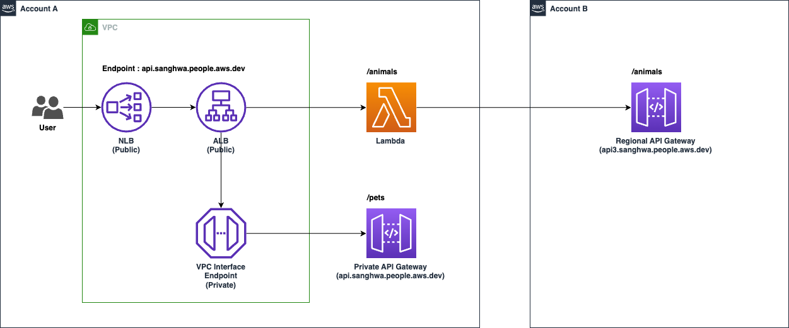

# lambda-http-forward-go
*Lambda HTTP Forward - Go*

This Go application demonstrates a Lambda function that acts as a proxy between the client and a target HTTP service. The function receives an incoming Application Load Balancer (ALB) event, forwards the request to the target HTTP service, and then returns the service's response to the client. 



To deploy this Lambda function, follow these steps: 

### 1. Create a Trust Policy and Role
    aws iam create-role --role-name lambda-ex --assume-role-policy-document file://trust-policy.json
    aws iam attach-role-policy --role-name lambda-ex --policy-arn arn:aws:iam::aws:policy/service-role/AWSLambdaBasicExecutionRole    

### 2. (Optional) Compile your Lambda function for the Linux target:
    GOOS=linux GOARCH=amd64 go build -o main main.go
    javascript
    

### 3. (Optional) Package your Lambda function as a ZIP file:
    zip main.zip main
    

### 4. Deploy the Lambda function using the AWS Management Console or the AWS CLI: 
- Create a new Lambda function with the "Go 1.x" runtime. - Upload the "main.zip" file as the function package.
- Set the handler as "main". - Grant the Lambda function the necessary permissions. 
- Create an ALB Target Group and configure it to forward requests to your Lambda function. 
- Configure your Application Load Balancer to route requests to the Target Group. 

or Using AWS CLI:

```
aws lambda create-function --function-name my-function --runtime go1.x --role arn:aws:iam::<YOUR_ACCOUNT_ID>:role/lambda-ex --handler main --zip-file fileb://main.zip
```

### 5. Set Environment Variable
You should set `APIURL` in the variable. This value is custom domain URL of the Account B's API Gateway.


### 6. (Optional) Update Lambda function code
```
GOOS=linux GOARCH=amd64 go build -o main main.go && zip main.zip main
aws lambda update-function-code --function-name my-function --zip-file fileb://main.zip
```

### For more information on working with Lambda functions in Go, refer to the official AWS documentation:
- AWS Lambda Go Programming Model: https://docs.aws.amazon.com/lambda/latest/dg/go-programming-model.html 
- AWS Lambda Go Function Examples: https://docs.aws.amazon.com/lambda/latest/dg/go-samples.html
- Using AWS Lambda with an Application Load Balancer: https://docs.aws.amazon.com/lambda/latest/dg/services-alb.html
